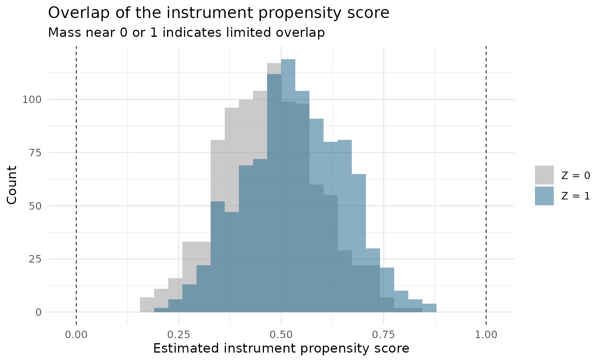
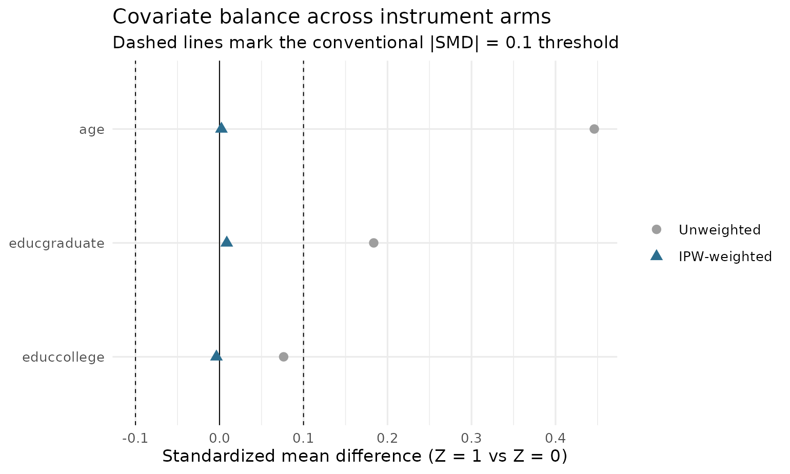
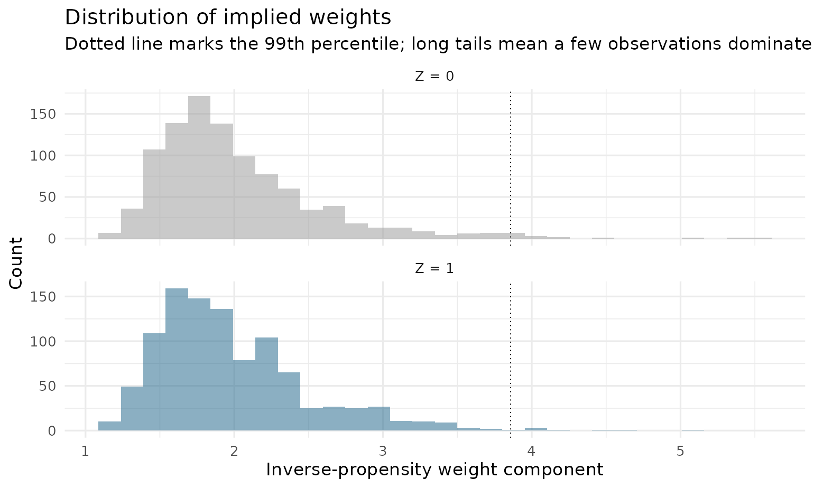

# A primer: doubly robust LATE estimation, from intuition to practice

This primer explains, with as little formalism as possible, what the
estimators in `drlate` do and when you would want them. It is a
companion to Słoczyński, Uysal, and Wooldridge (2022), *“Doubly Robust
Estimation of Local Average Treatment Effects Using Inverse Probability
Weighted Regression Adjustment”* (arXiv:2208.01300). Like the original
Stata command of the same name, this package implements the paper’s
method. Along the way it demonstrates every tool in the package:
estimation, diagnostics, weak-instrument-robust inference, the
bootstrap, the estimator comparison, and the doubly robust Hausman test.

## 1. The problem: a treatment people choose

Suppose you want to know the effect of a treatment $`D`$ (a job training
program, military service, a 401(k) plan) on an outcome $`Y`$ (wages,
savings). People *choose* whether to take the treatment, and the ones
who take it differ from the ones who don’t in ways you can’t fully
observe. Comparing treated and untreated outcomes — even with regression
controls — confounds the effect of the treatment with the effect of
being the kind of person who takes it.

The classic escape is an **instrument** $`Z`$: a binary variable that
shifts the *likelihood* of treatment but has no direct channel to the
outcome. Draft lottery numbers, distance to a college, randomized
*encouragement* to participate — all push some people into treatment
without otherwise touching their outcomes.

Imbens and Angrist (1994) showed what an instrument can and cannot give
you. It cannot reveal the effect of treatment for everyone. It
identifies the effect for **compliers** — the people whose treatment
status is actually moved by the instrument. That quantity is the **local
average treatment effect**:

``` math
\text{LATE} \;=\; \frac{\;\text{effect of } Z \text{ on } Y\;}
                      {\;\text{effect of } Z \text{ on } D\;}
```

The numerator is the *intent-to-treat* effect; the denominator is the
*first stage* (the share of compliers). With no covariates this ratio is
the Wald estimator, and it is exactly what two-stage least squares
computes.

### Why covariates enter

Real instruments are rarely as clean as a lottery. Distance to college
is exogenous *given* family background and region; a draft lottery is
clean, but conditioning on covariates still buys precision. So in
practice you need the instrument to be as-good-as-random **conditional
on covariates $`X`$** — and then both the numerator and the denominator
above become covariate-adjusted contrasts. How exactly to adjust them is
the entire subject of the paper and this package.

## 2. The four estimators in one picture

All four estimators in `drlate` build the same ratio; they differ only
in how each piece is adjusted for $`X`$. Each piece is an “effect of
$`Z`$ on something” — a problem formally identical to estimating an
average treatment effect of $`Z`$ under unconfoundedness — so the
familiar treatment-effects toolbox applies:

| `method` | How it adjusts | Needs correct… |
|----|----|----|
| `"ra"` | Regression adjustment: model $`Y`$ (and $`D`$) given $`X`$ in each instrument arm; average the predictions. | outcome/treatment models |
| `"ipw"` | Inverse probability weighting: model the **instrument propensity score** $`p(X) = \Pr(Z=1 \mid X)`$; reweight raw means by $`1/p`$ and $`1/(1-p)`$. | propensity score |
| `"aipw"` | Augmented IPW: regression adjustment plus an IPW correction term. | **either one** |
| `"ipwra"` | IPW **regression adjustment**: fit the outcome/treatment regressions *weighted* by the inverse propensity score. | **either one** |

The last two are **doubly robust (DR)**: they are consistent if the
propensity score model *or* the regression models are right — you get
two chances instead of one.

### Why the paper (and the package default) prefers IPWRA

AIPW achieves double robustness by *adding* a correction term, and that
sum can wander outside the logical range of the outcome — a predicted
probability of 1.3, a negative count. IPWRA achieves it by *reweighting
a quasi-likelihood regression*, so as long as you choose a sensible
family (logit for binary outcomes, Poisson for counts), fitted values
stay in range by construction. Hence IPWRA’s appealing small-sample
behavior in the paper’s simulations — and its place as the package
default.

A second practical lesson from the paper concerns **normalization**. Raw
IPW weights $`Z_i/\hat p(X_i)`$ need not average to one in a sample; if
a few observations have small estimated propensity scores, unnormalized
estimators can be erratic. Normalizing the weights to sum to one (the
Hájek construction) fixes this and costs nothing, so `normalized = TRUE`
is the default — it matters only for `"ipw"` and `"aipw"`; IPWRA is
normalized by construction.

## 3. A worked example

`drlate_sim` is a simulated dataset built so that the truth is known: a
binary instrument `rsncode`, a binary treatment `nvstat` with two-sided
noncompliance (60% compliers), and a continuous outcome `lwage`. The
true effect for compliers is **0.5**. The design plants two traps for
the naive approaches: the treatment is endogenous (people who always
take it have higher baseline outcomes), and the instrument is *not*
unconditionally random (the probability of `rsncode = 1` rises with
`age` and education, which also shift the outcome).

``` r

library(drlate)
data(drlate_sim)
str(drlate_sim)
#> 'data.frame':    2000 obs. of  7 variables:
#>  $ lwage  : num  1.892 -1.625 -0.484 0.92 -0.392 ...
#>  $ kwage  : num  2.575 0.444 0.785 1.584 0.822 ...
#>  $ hijob  : int  1 0 0 0 0 0 0 0 1 1 ...
#>  $ nvstat : int  0 0 0 1 0 1 0 1 0 1 ...
#>  $ rsncode: int  1 0 1 1 0 1 0 1 0 1 ...
#>  $ age    : num  37 12 31 27 33 33 23 29 37 51 ...
#>  $ educ   : Factor w/ 3 levels "hs","college",..: 1 1 1 2 2 2 1 1 1 1 ...
```

### The naive answers fail

Comparing treated to untreated (even though this is “just a
regression”):

``` r

coef(lm(lwage ~ nvstat + age + educ, drlate_sim))["nvstat"]
#>    nvstat 
#> 0.8425038
```

Biased upward — always-takers are different people. The raw Wald ratio
ignores that the instrument favors older, more educated workers:

``` r

with(drlate_sim,
     (mean(lwage[rsncode == 1]) - mean(lwage[rsncode == 0])) /
     (mean(nvstat[rsncode == 1]) - mean(nvstat[rsncode == 0])))
#> [1] 1.045469
```

Twice the truth.

### The drlate answer

Three formulas, one per model: the **outcome** model, the **treatment**
model, and the **instrument propensity score** model.

``` r

fit <- drlate(outcome    = lwage   ~ age + educ,
              treatment  = nvstat  ~ age + educ,
              instrument = rsncode ~ age + educ,
              data = drlate_sim)
summary(fit)
#> 
#> Local average treatment effect
#> Number of obs    : 2,000
#> Estimator        : IPWRA
#> Outcome model    : linear
#> Treatment model  : logit
#> Instrument model : logit (MLE)
#> 
#>              Estimate Std. Error z value   Pr(>|z|) [95% conf. interval]
#> LATE: D on Y   0.4705    0.07915   5.944  2.786e-09     0.3153    0.6256
#> ATE: Z on Y    0.2845    0.05043   5.642  1.679e-08     0.1857    0.3834
#> ATE: Z on D    0.6048    0.01837  32.929 8.326e-238     0.5688    0.6408
#> 
#> First stage (Z on D): z = 32.93 (z^2 ~ first-stage F = 1084)
```

Read the three rows bottom-up:

- **ATE: Z on D** — the first stage: the instrument moves the treatment
  probability by about 0.60 (the complier share).
- **ATE: Z on Y** — the intent-to-treat effect of the instrument on the
  outcome.
- **LATE: D on Y** — their ratio, the causal effect for compliers. The
  95% interval comfortably covers the true 0.5.

The final line reports **first-stage strength**: with a single binary
instrument, the squared z-statistic is the first-stage robust F. Here F
≈ 1084 — far above the conventional F = 10 danger threshold — so Wald
inference on the ratio is trustworthy. Section 6 shows what the package
does when it isn’t.

The standard errors here are not an afterthought: every estimation stage
(the propensity score, both outcome regressions, both treatment
regressions, and the ratio itself) is stacked into one moment system and
a joint sandwich variance is computed. The uncertainty from estimating
the propensity score propagates into the LATE’s standard error, exactly
as in the Stata original.

### Seeing double robustness work

The DGP has the propensity score and the outcomes both depending on
`age` and `educ`. Give the estimator a *wrong* propensity score model
(intercept only) but correct regressions — then a *wrong* outcome model
but a correct propensity score:

``` r

# Propensity score misspecified; regressions correct
coef(drlate(lwage ~ age + educ, nvstat ~ age + educ, rsncode ~ 1,
            data = drlate_sim))[1]
#> LATE: D on Y 
#>    0.4597253

# Regressions misspecified (intercept only); propensity score correct
coef(drlate(lwage ~ 1, nvstat ~ 1, rsncode ~ age + educ,
            data = drlate_sim))[1]
#> LATE: D on Y 
#>    0.4740516
```

Either way the estimate stays near 0.5: one correct model is enough.
(Misspecify *both* and no estimator can save you.)

## 4. Checking the design: diagnostics

An estimate deserves evidence that the design behind it is sound.
[`plot()`](https://rdrr.io/r/graphics/plot.default.html) provides the
three standard displays.

### Overlap

IPW-type estimators divide by $`\hat p(X)`$ and $`1-\hat p(X)`$, so the
estimated instrument propensity scores must stay away from 0 and 1.
Healthy overlap looks like two well-mixed distributions:

``` r

plot(fit, type = "overlap")
```



[`drlate()`](https://kvenkita.github.io/drlate/reference/drlate.md)
refuses to estimate if any score breaches
`[pstolerance, 1 - pstolerance]`; set `osample = TRUE` to get back an
indicator of the violating observations instead, so you can inspect them
before restricting the sample.

### Covariate balance

The whole point of weighting by the inverse propensity score is to make
the instrument arms comparable on covariates. The love plot shows
standardized mean differences before and after weighting — weighted dots
inside the conventional ±0.1 band mean the propensity score model is
doing its job:

``` r

plot(fit, type = "balance")
```



The underlying numbers come from
[`balance()`](https://kvenkita.github.io/drlate/reference/balance.md):

``` r

balance(fit)
#>       variable smd_unweighted smd_weighted
#> 1          age     0.44613912  0.002276611
#> 2  educcollege     0.07633523 -0.003643849
#> 3 educgraduate     0.18356486  0.008657272
```

`age` moves from a standardized difference of 0.45 to nearly zero after
weighting.

### Weight distributions

A few enormous weights mean a few observations dominate the estimate —
the classic symptom of thin overlap:

``` r

plot(fit, type = "weights")
```



## 5. Choosing models and options

### Outcome and treatment families

The treatment and the outcome may each be continuous, binary, or a
count; choose families so fitted values respect the response’s range —
the heart of the IPWRA recommendation:

``` r

# Binary outcome: logit keeps fitted probabilities in [0, 1]
coef(drlate(hijob ~ age + educ, nvstat ~ age + educ, rsncode ~ age + educ,
            data = drlate_sim, omodel = "logit"))
#> LATE: D on Y  ATE: Z on Y  ATE: Z on D 
#>    0.1742853    0.1054104    0.6048151

# Positive outcome: Poisson (quasi-likelihood; no distributional claim)
coef(drlate(kwage ~ age + educ, nvstat ~ age + educ, rsncode ~ age + educ,
            data = drlate_sim, omodel = "poisson"))
#> LATE: D on Y  ATE: Z on Y  ATE: Z on D 
#>    0.6088370    0.3682338    0.6048151
```

### Instrument propensity score flavors

Beyond logit MLE, two estimators tailor the propensity score to its job
in the weights:

- `ivmodel = "cbps"` — covariate balancing (Imai and Ratkovic 2014):
  chooses the logit coefficients so the inverse-probability weights
  exactly balance the covariates between instrument arms.
- `ivmodel = "ipt"` — inverse probability tilting (Graham, Pinto, and
  Egel 2012): fits a separate tilted score per arm; the resulting
  weights are exactly normalized by construction.

``` r

coef(drlate(lwage ~ age + educ, nvstat ~ age + educ, rsncode ~ age + educ,
            data = drlate_sim, ivmodel = "ipt"))[1]
#> LATE: D on Y 
#>    0.4706598
```

### LATT: the effect for treated compliers

`estimand = "latt"` reweights everything toward the treated population —
“among those who took the treatment, what did it do?”:

``` r

coef(drlate(lwage ~ age + educ, nvstat ~ age + educ, rsncode ~ age + educ,
            data = drlate_sim, estimand = "latt"))
#> LATT: D on Y  ATT: Z on Y  ATT: Z on D 
#>    0.4725042    0.2844545    0.6020148
```

Weights (`weights =`) and clustered standard errors (`cluster =`) are
available everywhere.

## 6. When the instrument is weak: Fieller confidence sets

The LATE is a ratio, and ratios with imprecise denominators behave
badly: the usual (delta-method) confidence interval can have
far-from-nominal coverage when the first stage is weak. The package
watches for this — whenever the first-stage F drops below 10, the
printout flags it and shows a **Fieller confidence set** alongside.

The Fieller set inverts the test of $`H_0:\ \text{num} - t \cdot
\text{denom} = 0`$ using the *joint* covariance of the numerator and the
denominator (which the stacked moment system provides). Unlike the Wald
interval, it keeps its promised asymptotic coverage no matter how weak
the instrument — at the honest price that it may be **unbounded** when
the data barely identify the ratio.

Watch it engage on a deliberately broken design (instrument shuffled at
random in a small subsample, so the true first stage is zero):

``` r

set.seed(42)
d_weak <- drlate_sim[1:300, ]
d_weak$zweak <- sample(d_weak$rsncode)
fit_weak <- drlate(lwage ~ age, nvstat ~ age, zweak ~ age, data = d_weak)
print(fit_weak)
#> 
#> Local average treatment effect
#> Number of obs    : 300
#> Estimator        : IPWRA
#> Outcome model    : linear
#> Treatment model  : logit
#> Instrument model : logit (MLE)
#> 
#>               Estimate Std. Error z value Pr(>|z|) [95% conf. interval]
#> LATE: D on Y 13.662047  118.10943  0.1157   0.9079  -217.8282  245.1523
#> ATE: Z on Y  -0.087409    0.12389 -0.7055   0.4805    -0.3302    0.1554
#> ATE: Z on D  -0.006398    0.05692 -0.1124   0.9105    -0.1180    0.1052
#> 
#> First stage (Z on D): z = -0.1124 (z^2 ~ first-stage F = 0.0126)  [weak: Wald inference on the ratio may be unreliable]
#> Fieller 95% confidence set for the late: (-Inf, Inf) - the first stage is uninformative
```

The Fieller set is available on demand for any fit:

``` r

confint(fit, method = "fieller")     # strong instrument: ~ Wald interval
#> Fieller 95% confidence set for LATE: D on Y:
#>   [0.3131, 0.6239]
```

In the package’s Monte Carlo validation, at first-stage F ≈ 2.5 the
Fieller set covered the true LATE 95.5% of the time (reporting an
unbounded set in two-thirds of replications — the statistically honest
answer) while the Wald interval degenerated.

## 7. Bootstrap inference

The paper notes that inference is straightforward “both analytically and
using the nonparametric bootstrap.” The analytic sandwich is the
default; the bootstrap re-runs the entire estimation pipeline (including
the propensity score) on each resample:

``` r

fit_boot <- drlate(lwage ~ age + educ, nvstat ~ age + educ,
                   rsncode ~ age + educ, data = drlate_sim,
                   vcov = "bootstrap", boot_reps = 199, boot_seed = 42)
summary(fit_boot)
#> 
#> Local average treatment effect
#> Number of obs    : 2,000
#> Estimator        : IPWRA
#> Outcome model    : linear
#> Treatment model  : logit
#> Instrument model : logit (MLE)
#> Std. errors      : nonparametric bootstrap (199 of 199 reps)
#> 
#>              Estimate Std. Error z value   Pr(>|z|) [2.5% boot boot 97.5%]
#> LATE: D on Y   0.4705    0.07387   6.369  1.906e-10     0.3240      0.5987
#> ATE: Z on Y    0.2845    0.04748   5.993  2.061e-09     0.1858      0.3746
#> ATE: Z on D    0.6048    0.01852  32.654 7.060e-234     0.5684      0.6417
#> 
#> First stage (Z on D): z = 32.93 (z^2 ~ first-stage F = 1084)
```

Point estimates are unchanged; standard errors and the confidence
intervals (now percentile intervals from the bootstrap distribution)
come from the resamples. When `cluster` is supplied, whole clusters are
resampled. Draws that fail — degenerate resamples, overlap violations —
are dropped and counted; a non-trivial failure rate is itself a sign of
weak identification, in which case prefer the Fieller set.

## 8. How much does the estimator choice matter?

Referees routinely ask for this table. One call runs all four
estimators:

``` r

cmp <- drlate_compare(lwage ~ age + educ, nvstat ~ age + educ,
                      rsncode ~ age + educ, data = drlate_sim)
#> method = "ipw": dropping outcome/treatment covariates (weighted means only).
#> method = "ra": dropping instrument covariates (no propensity score).
cmp
#> Estimator comparison (LATE)
#> 
#>   estimator estimate     se           95% CI
#>       ipwra   0.4705 0.0792 [0.3153, 0.6256]
#>   ipw (nrm)   0.4741 0.0793 [0.3187, 0.6295]
#>  aipw (nrm)   0.4702 0.0792 [0.3150, 0.6254]
#>          ra   0.4597 0.0792 [0.3045, 0.6150]
plot(cmp)
```


A caveat printed in the documentation bears repeating: IPW carries no
outcome/treatment regressions and RA no propensity score, so those rows
necessarily use reduced specifications — the IPWRA-vs-AIPW pair is the
like-for-like doubly robust comparison. Here all four agree closely,
which is what a healthy design looks like.

## 9. Do you even need the instrument? The DR Hausman test

The paper’s Section 5 proposes a specification test that the Stata
package does not implement. The logic: under **one-sided noncompliance**
(nobody gets the treatment without the instrument), the LATT estimated
*through the instrument* and the ATT estimated *assuming the treatment
is unconfounded given $`X`$* target the same parameter — if
unconfoundedness holds. So a significant difference between the two
doubly robust estimates is evidence against unconfoundedness. Unlike the
textbook OLS-vs-IV Hausman test, this comparison survives heterogeneous
treatment effects.

The simulated data are built with confounded treatment (always-takers
have higher baseline wages), so after imposing one-sided noncompliance
the test should — and does — reject:

``` r

d_os <- drlate_sim
d_os$nvstat[d_os$rsncode == 0] <- 0L   # impose one-sided noncompliance

dr_hausman(lwage ~ age + educ, nvstat ~ age + educ, rsncode ~ age + educ,
           data = d_os)
#> 
#>  Doubly robust Hausman test of unconfoundedness
#>  (Sloczynski-Uysal-Wooldridge 2022, one-sided noncompliance)
#> 
#> data:  d_os
#> z = -5.7425, p-value = 9.331e-09
#> alternative hypothesis: two.sided
#> sample estimates:
#>    DR LATT     DR ATT difference 
#>  0.3760331  0.6323210 -0.2562878
```

The unconfoundedness-based ATT (≈ 0.63) is biased upward by exactly the
selection the DGP builds in, while the instrument-based LATT (≈ 0.38 in
this one-sided subpopulation) is protected; the difference is six
standard errors from zero. In practice: a rejection says the controls
alone do not suffice — you needed the instrument; a non-rejection says
the controls may suffice, and the much more precise
unconfoundedness-based estimator becomes defensible.

The standard error of the difference is analytic: both estimators’
moment conditions are stacked into one system so their correlation is
accounted for — the construction the paper sketches and this package
carries out. (In Monte Carlo under a true null the test rejects at 4.7%
for a nominal 5% level.)

## 10. Coming from Stata

| Stata | R |
|----|----|
| `drlate (lwage age_5) (nvstat age_5) (rsncode age_5)` | `drlate(lwage ~ age_5, nvstat ~ age_5, rsncode ~ age_5, data = d)` |
| `(y x, poisson)` | `omodel = "poisson"` |
| `(z x, ipt)` | `ivmodel = "ipt"` |
| `, latt` | `estimand = "latt"` |
| `, method(aipw) unnrm` | `method = "aipw", normalized = FALSE` |
| `[pw = w]` | `weights = "w"` |
| `, vce(cluster id)` | `cluster = "id"` |
| `i.educ` factor syntax | a [`factor()`](https://rdrr.io/r/base/factor.html) column in the formula |
| — | [`plot()`](https://rdrr.io/r/graphics/plot.default.html), [`balance()`](https://kvenkita.github.io/drlate/reference/balance.md), `confint(method = "fieller")`, `vcov = "bootstrap"`, [`dr_hausman()`](https://kvenkita.github.io/drlate/reference/dr_hausman.md), [`drlate_compare()`](https://kvenkita.github.io/drlate/reference/drlate_compare.md) (R only) |

Point estimates and standard errors agree with the Stata package to
numerical precision; the package’s test suite enforces this against
fixtures generated by Stata on the SIPP extract used in the original
help file.

## References

- Słoczyński, T., S. D. Uysal, and J. M. Wooldridge (2022). “Doubly
  Robust Estimation of Local Average Treatment Effects Using Inverse
  Probability Weighted Regression Adjustment.” arXiv:2208.01300.
- Imbens, G. W., and J. D. Angrist (1994). “Identification and
  Estimation of Local Average Treatment Effects.” *Econometrica* 62(2),
  467–475.
- Abadie, A. (2003). “Semiparametric Instrumental Variable Estimation of
  Treatment Response Models.” *Journal of Econometrics* 113(2), 231–263.
- Donald, S. G., Y.-C. Hsu, and R. P. Lieli (2014). “Testing the
  Unconfoundedness Assumption via Inverse Probability Weighted
  Estimators of (L)ATT.” *Journal of Business & Economic Statistics*
  32(3), 395–415.
- Fieller, E. C. (1954). “Some Problems in Interval Estimation.”
  *JRSS-B* 16(2), 175–185.
- Graham, B. S., C. C. de Xavier Pinto, and D. Egel (2012). “Inverse
  Probability Tilting for Moment Condition Models with Missing Data.”
  *Review of Economic Studies* 79(3), 1053–1079.
- Imai, K., and M. Ratkovic (2014). “Covariate Balancing Propensity
  Score.” *JRSS-B* 76(1), 243–263.
