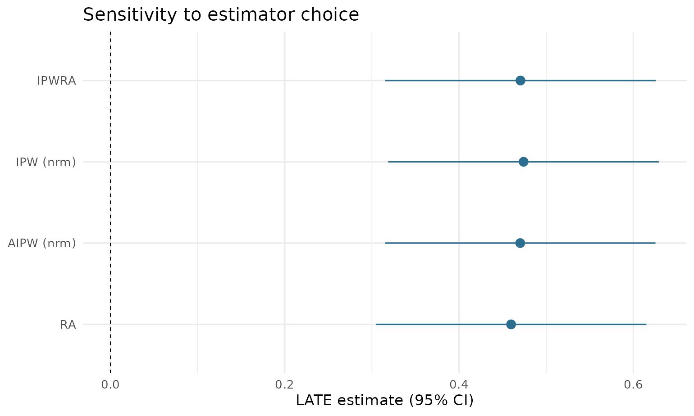

# Doubly robust estimation of the LATE and LATT with drlate

## Overview

`drlate` estimates the local average treatment effect (LATE) and the
local average treatment effect on the treated (LATT) from observational
data with a binary instrument. It implements the complete estimator
suite of Słoczyński, Uysal, and Wooldridge: the doubly robust estimators
of their 2022 paper (the Stata command `drlate`, Statistical Software
Components S459708) and the Abadie-kappa weighting estimators of their
2025 *JBES* paper (the Stata command `kappalate`, S459257), unified
behind one interface and one inference architecture.

The estimation core supports:

- **Doubly robust and regression/weighting estimators** (`method`):
  inverse-probability-weighted regression adjustment (`"ipwra"`, the
  default, doubly robust), inverse probability weighting (`"ipw"`),
  augmented inverse probability weighting (`"aipw"`, doubly robust), and
  regression adjustment (`"ra"`).
- **Abadie-kappa weighting estimators**: `"kappa"` (kappalate’s
  `tau_a`), `"kappa0"` (`tau_a,0`), and `"kappa10"` (`tau_a,10`);
  together with the two IPW variants (= `tau_u` and `tau_a,1`) these
  complete the five-estimator menu of the 2025 paper.
- **Outcome and treatment models**: linear, logistic, probit, or
  Poisson, plus fractional-logit and fractional-probit for outcomes in
  `[0, 1]`, so the response may be continuous, binary, a count, or a
  proportion (matching the Stata `lateffects` `omodel`/`tmodel`
  options).
- **Instrument propensity score models** (`ivmodel`): logistic
  regression by maximum likelihood (default), covariate balancing
  (`"cbps"`, Imai and Ratkovic 2014), inverse probability tilting
  (`"ipt"`, Graham, Pinto, and Egel 2012), or probit maximum likelihood
  (`"probit"`, for the weighting estimators).
- **Normalized** (default) or unnormalized weighting for IPW and AIPW.
- Sampling weights and cluster-robust standard errors.

Beyond the two Stata commands, the package adds a common workflow layer,
and makes it available on the kappa weighting estimators too, where
`kappalate` itself offers only robust and cluster-robust standard
errors:

- **Diagnostics**:
  [`plot()`](https://rdrr.io/r/graphics/plot.default.html) displays of
  propensity-score overlap, covariate balance, and implied weights;
  [`balance()`](https://kvenkita.github.io/drlate/reference/balance.md)
  tables and the
  [`balance_test()`](https://kvenkita.github.io/drlate/reference/balance_test.md)
  overidentification balance test;
  [`complier_means()`](https://kvenkita.github.io/drlate/reference/complier_means.md)
  complier profiling; first-stage strength on every printout.
- **Weak-instrument-robust inference**: Fieller confidence sets via
  `confint(method = "fieller")` (for the ratio-form estimators,
  including `"kappa"` and `"kappa0"`).
- **Bootstrap inference**: `vcov = "bootstrap"` (cluster-aware,
  parallelizable).
- **The DR Hausman test** of unconfoundedness from the 2022 paper’s
  Section 5
  ([`dr_hausman()`](https://kvenkita.github.io/drlate/reference/dr_hausman.md)),
  with an analytic standard error from a jointly stacked moment system.
- **Estimator comparison**:
  [`drlate_compare()`](https://kvenkita.github.io/drlate/reference/drlate_compare.md)
  with a dot-whisker plot.

The estimators are validated against the authors’ Stata commands by
golden-fixture parity (estimates and standard errors), and the inference
extensions by Monte Carlo.

### Joint inference

drlate computes point estimates from sequential weighted regressions.
For inference, it stacks the moment conditions of *every* estimation
stage — the instrument propensity score, the outcome regressions, the
treatment regressions, and the causal aggregates — into one
just-identified M-estimation system; the variance is the sandwich
$`A^{-1} B A^{-\top} / n`$ evaluated at the estimates. This reproduces
the Stata package’s `gmm, onestep iterate(0)` construction: standard
errors account for the estimation uncertainty of each stage, including
the first-stage propensity score.

## Example

The bundled `drlate_sim` data simulates a binary instrument `rsncode`, a
binary treatment `nvstat` with two-sided noncompliance, and outcomes on
three scales. The true complier effect on `lwage` is 0.5.

``` r

library(drlate)
data(drlate_sim)

fit <- drlate(lwage ~ age + educ,      # outcome model
              nvstat ~ age + educ,     # treatment model
              rsncode ~ age + educ,    # instrument propensity score model
              data = drlate_sim)
summary(fit)
#> 
#> Local average treatment effect
#> Number of obs    : 2,000
#> Estimator        : IPWRA
#> Outcome model    : linear
#> Treatment model  : logit
#> Instrument model : logit (MLE)
#> 
#>              Estimate Std. Error z value   Pr(>|z|) [95% conf. interval]
#> LATE: D on Y   0.4705    0.07915   5.944  2.786e-09     0.3153    0.6256
#> ATE: Z on Y    0.2845    0.05043   5.642  1.679e-08     0.1857    0.3834
#> ATE: Z on D    0.6048    0.01837  32.929 8.326e-238     0.5688    0.6408
#> 
#> First stage (Z on D): z = 32.93 (z^2 ~ first-stage F = 1084)
```

The three reported quantities mirror the Stata package’s output: the
causal estimate (LATE), the intent-to-treat effect of the instrument on
the outcome (numerator), and the first-stage effect of the instrument on
the treatment (denominator), with the LATE formed as their ratio.

``` r

coef(fit)
#> LATE: D on Y  ATE: Z on Y  ATE: Z on D 
#>    0.4704664    0.2845452    0.6048151
confint(fit)
#>                  2.5 %    97.5 %
#> LATE: D on Y 0.3153295 0.6256033
#> ATE: Z on Y  0.1857013 0.3833891
#> ATE: Z on D  0.5688165 0.6408138
```

### Other estimators

``` r

# AIPW with unnormalized moments
drlate(lwage ~ age + educ, nvstat ~ age + educ, rsncode ~ age + educ,
       data = drlate_sim, method = "aipw", normalized = FALSE)
#> 
#> Local average treatment effect
#> Number of obs    : 2,000
#> Estimator        : AIPW (unnormalized)
#> Outcome model    : linear
#> Treatment model  : logit
#> Instrument model : logit (MLE)
#> 
#>              Estimate Std. Error z value   Pr(>|z|) [95% conf. interval]
#> LATE: D on Y   0.4702    0.07918   5.938  2.877e-09     0.3150    0.6254
#> ATE: Z on Y    0.2843    0.05044   5.637  1.731e-08     0.1855    0.3832
#> ATE: Z on D    0.6047    0.01838  32.906 1.820e-237     0.5687    0.6407
#> 
#> First stage (Z on D): z = 32.91 (z^2 ~ first-stage F = 1083)

# IPW: no covariates in the outcome/treatment equations
drlate(lwage ~ 1, nvstat ~ 1, rsncode ~ age + educ,
       data = drlate_sim, method = "ipw")
#> 
#> Local average treatment effect
#> Number of obs    : 2,000
#> Estimator        : IPW (normalized; kappalate tau_u)
#> Outcome model    : weighted mean
#> Treatment model  : weighted mean
#> Instrument model : logit (MLE)
#> 
#>              Estimate Std. Error z value   Pr(>|z|) [95% conf. interval]
#> LATE: D on Y   0.4741    0.07929   5.979  2.247e-09     0.3187    0.6295
#> ATE: Z on Y    0.2867    0.05047   5.681  1.343e-08     0.1878    0.3856
#> ATE: Z on D    0.6047    0.01836  32.944 5.111e-238     0.5688    0.6407
#> 
#> First stage (Z on D): z = 32.94 (z^2 ~ first-stage F = 1085)

# Regression adjustment: no instrument covariates
drlate(lwage ~ age + educ, nvstat ~ age + educ, rsncode ~ 1,
       data = drlate_sim, method = "ra")
#> 
#> Local average treatment effect
#> Number of obs    : 2,000
#> Estimator        : RA
#> Outcome model    : linear
#> Treatment model  : logit
#> Instrument model : logit (MLE)
#> 
#>              Estimate Std. Error z value   Pr(>|z|) [95% conf. interval]
#> LATE: D on Y   0.4597    0.07921   5.804  6.477e-09     0.3045    0.6150
#> ATE: Z on Y    0.2782    0.05041   5.520  3.391e-08     0.1795    0.3770
#> ATE: Z on D    0.6053    0.01833  33.011 5.685e-239     0.5693    0.6412
#> 
#> First stage (Z on D): z = 33.01 (z^2 ~ first-stage F = 1090)
```

### Abadie-kappa weighting estimators

The kappa methods are pure weighting estimators — covariates enter only
through the instrument propensity score, so the outcome and treatment
formulas are intercept-only. The printed output shows each estimator’s
`kappalate` name:

``` r

# Normalized Abadie kappa (kappalate tau_a,10); reports the LATE only,
# since the estimator is a difference of two ratios
drlate(lwage ~ 1, nvstat ~ 1, rsncode ~ age + educ,
       data = drlate_sim, method = "kappa10")
#> 
#> Local average treatment effect
#> Number of obs    : 2,000
#> Estimator        : KAPPA10 (tau_a,10; normalized Abadie kappa weighting)
#> Outcome model    : none (kappa weighting)
#> Treatment model  : none (kappa weighting)
#> Instrument model : logit (MLE)
#> 
#>              Estimate Std. Error z value  Pr(>|z|) [95% conf. interval]
#> LATE: D on Y    0.474    0.07929   5.979 2.249e-09     0.3186    0.6294
#> 
#> First stage (Z on D): z = 32.75 (z^2 ~ first-stage F = 1072)

# Unnormalized Abadie kappa (tau_a); Fieller sets available
fit_k <- drlate(lwage ~ 1, nvstat ~ 1, rsncode ~ age + educ,
                data = drlate_sim, method = "kappa")
confint(fit_k, method = "fieller")
#> Fieller 95% confidence set for LATE: D on Y:
#>   [0.3142, 0.6282]
```

### LATT, other model families, and IPT

``` r

# LATT with an inverse-probability-tilted instrument propensity score
drlate(lwage ~ age + educ, nvstat ~ age + educ, rsncode ~ age + educ,
       data = drlate_sim, estimand = "latt", ivmodel = "ipt")
#> 
#> Local average treatment effect on the treated
#> Number of obs    : 2,000
#> Estimator        : IPWRA
#> Outcome model    : linear
#> Treatment model  : logit
#> Instrument model : logit (IPT)
#> 
#>              Estimate Std. Error z value   Pr(>|z|) [95% conf. interval]
#> LATT: D on Y   0.4725    0.08088   5.842  5.156e-09     0.3140    0.6310
#> ATT: Z on Y    0.2845    0.05144   5.530  3.209e-08     0.1836    0.3853
#> ATT: Z on D    0.6020    0.01887  31.903 2.425e-223     0.5650    0.6390
#> 
#> First stage (Z on D): z = 31.9 (z^2 ~ first-stage F = 1018)

# Poisson outcome model for the positive wage level
drlate(kwage ~ age + educ, nvstat ~ age + educ, rsncode ~ 1,
       data = drlate_sim, method = "ra", omodel = "poisson")
#> 
#> Local average treatment effect
#> Number of obs    : 2,000
#> Estimator        : RA
#> Outcome model    : poisson
#> Treatment model  : logit
#> Instrument model : logit (MLE)
#> 
#>              Estimate Std. Error z value   Pr(>|z|) [95% conf. interval]
#> LATE: D on Y   0.5931    0.10730   5.527  3.253e-08     0.3828    0.8034
#> ATE: Z on Y    0.3589    0.06796   5.282  1.278e-07     0.2258    0.4921
#> ATE: Z on D    0.6053    0.01833  33.011 5.685e-239     0.5693    0.6412
#> 
#> First stage (Z on D): z = 33.01 (z^2 ~ first-stage F = 1090)
```

### Clustered standard errors and weights

``` r

drlate(lwage ~ age, nvstat ~ age, rsncode ~ age, data = drlate_sim,
       cluster = drlate_sim$educ)
#> 
#> Local average treatment effect
#> Number of obs    : 2,000
#> Number of clusters: 3
#> Estimator        : IPWRA
#> Outcome model    : linear
#> Treatment model  : logit
#> Instrument model : logit (MLE)
#> 
#>              Estimate Std. Error z value Pr(>|z|) [95% conf. interval]
#> LATE: D on Y   0.5254   0.083820   6.268 3.65e-10     0.3611    0.6897
#> ATE: Z on Y    0.3171   0.051494   6.159 7.34e-10     0.2162    0.4181
#> ATE: Z on D    0.6036   0.001815 332.624 0.00e+00     0.6000    0.6071
#> 
#> First stage (Z on D): z = 332.6 (z^2 ~ first-stage F = 110638)
```

## Diagnostics

[`plot()`](https://rdrr.io/r/graphics/plot.default.html) provides the
standard design checks — propensity-score overlap, covariate balance
before/after weighting (the love plot), and the implied weight
distributions;
[`balance()`](https://kvenkita.github.io/drlate/reference/balance.md)
returns the standardized mean differences as a data frame:

``` r

fit <- drlate(lwage ~ age + educ, nvstat ~ age + educ,
              rsncode ~ age + educ, data = drlate_sim)
plot(fit, type = "balance")
```


``` r

balance(fit)
#>       variable smd_unweighted smd_weighted
#> 1          age     0.44613912  0.002276611
#> 2  educcollege     0.07633523 -0.003643849
#> 3 educgraduate     0.18356486  0.008657272
```

``` r

plot(fit, type = "overlap")
```


[`complier_means()`](https://kvenkita.github.io/drlate/reference/complier_means.md)
profiles how the compliers differ from the population (weighting by
Abadie’s kappa), and
[`balance_test()`](https://kvenkita.github.io/drlate/reference/balance_test.md)
runs the Imai–Ratkovic overidentification test of whether the
propensity-score model balances the covariates — diagnostics that mirror
the postestimation suite of Stata’s `lateffects` command:

``` r

complier_means(fit)
#>       variable population_mean complier_mean   difference
#> 1          age         34.5560    34.3303393 -0.225660695
#> 2  educcollege          0.3615     0.3590211 -0.002478943
#> 3 educgraduate          0.1395     0.1431700  0.003670025
balance_test(fit)
#> Imai-Ratkovic covariate-balance test (overidentification)
#> 
#>   Hansen J = 3.0473   df = 4   p-value = 0.5499
#>   Instrument propensity score: logit (n = 2000)
#> 
#>   H0: the propensity-score model balances the covariates.
```

## Inference beyond the default sandwich

Every printout reports the first-stage z (with z² ≈ F for a single
binary instrument) and flags weakness below F = 10. The package adds two
inference tools:

``` r

# Weak-instrument-robust Fieller confidence set (may be unbounded when
# the first stage is weak -- that is the honest answer)
confint(fit, method = "fieller")
#> Fieller 95% confidence set for LATE: D on Y:
#>   [0.3131, 0.6239]

# Nonparametric bootstrap (percentile CIs; clusters resampled whole
# when `cluster` is supplied)
fit_b <- drlate(lwage ~ age + educ, nvstat ~ age + educ,
                rsncode ~ age + educ, data = drlate_sim,
                vcov = "bootstrap", boot_reps = 199, boot_seed = 1)
confint(fit_b)
#>                  2.5 %    97.5 %
#> LATE: D on Y 0.3178074 0.6159603
#> ATE: Z on Y  0.1965297 0.3794341
#> ATE: Z on D  0.5774018 0.6401410
```

## The DR Hausman test of unconfoundedness

Under one-sided noncompliance (nobody takes the treatment without the
instrument), the instrument-based LATT equals the unconfoundedness-based
ATT if treatment assignment is unconfounded given the covariates.
Section 5 of the 2022 paper turns this equality into a
heterogeneity-robust Hausman test, implemented here; the Stata package
does not provide it:

``` r

d_os <- drlate_sim
d_os$nvstat[d_os$rsncode == 0] <- 0L
dr_hausman(lwage ~ age + educ, nvstat ~ age + educ, rsncode ~ age + educ,
           data = d_os)
#> 
#>  Doubly robust Hausman test of unconfoundedness
#>  (Sloczynski-Uysal-Wooldridge 2022, one-sided noncompliance)
#> 
#> data:  d_os
#> z = -5.7425, p-value = 9.331e-09
#> alternative hypothesis: two.sided
#> sample estimates:
#>    DR LATT     DR ATT difference 
#>  0.3760331  0.6323210 -0.2562878
```

The simulated treatment is confounded by construction, and the test
rejects.

## Comparing estimators

``` r

cmp <- drlate_compare(lwage ~ age + educ, nvstat ~ age + educ,
                      rsncode ~ age + educ, data = drlate_sim)
#> method = "ipw": dropping outcome/treatment covariates (weighted means only).
#> method = "ra": dropping instrument covariates (no propensity score).
cmp
#> Estimator comparison (LATE)
#> 
#>   estimator estimate     se           95% CI
#>       ipwra   0.4705 0.0792 [0.3153, 0.6256]
#>   ipw (nrm)   0.4741 0.0793 [0.3187, 0.6295]
#>  aipw (nrm)   0.4702 0.0792 [0.3150, 0.6254]
#>          ra   0.4597 0.0792 [0.3045, 0.6150]
plot(cmp)
```



## Replicating the Stata examples

The Stata help file’s examples use a public extract from the Survey of
Income and Program Participation (SIPP). The equivalent R calls are:

``` r

sipp <- haven::read_dta("https://people.brandeis.edu/~tslocz/sipp.dta")
sipp <- subset(as.data.frame(sipp),
               !is.na(kwage) & !is.na(educ) & rsncode != 999)
sipp$lwage <- log(sipp$kwage)

# Stata: drlate (lwage age_5) (nvstat age_5) (rsncode age_5)
drlate(lwage ~ age_5, nvstat ~ age_5, rsncode ~ age_5, data = sipp)

# Stata: drlate (lwage age_5) (nvstat age_5) (rsncode age_5, ipt), latt
drlate(lwage ~ age_5, nvstat ~ age_5, rsncode ~ age_5, data = sipp,
       ivmodel = "ipt", estimand = "latt")

# Stata: kappalate lwage (nvstat = rsncode) age_5, zmodel(logit) which(all)
drlate(lwage ~ 1, nvstat ~ 1, rsncode ~ age_5, data = sipp,
       method = "kappa")     # tau_a; likewise "kappa0", "kappa10",
                             # and method = "ipw" for tau_u / tau_a,1

# Stata: kappalate lwage (nvstat = rsncode) age_5, zmodel(probit)
drlate(lwage ~ 1, nvstat ~ 1, rsncode ~ age_5, data = sipp,
       method = "kappa", ivmodel = "probit")
```

The package’s test suite verifies numerical equivalence of estimates and
standard errors against fixtures generated by both Stata commands on
this dataset (see `inst/stata/make-fixtures.do` and
`inst/stata/make-kappalate-fixtures.do`).

## Citation

If you use drlate in your research, please cite the R package, the
methodological paper for the estimators you use, and the original Stata
module (see `citation("drlate")` for BibTeX entries):

> Venkitasubramanian, K. (2026). drlate: Doubly Robust Estimation of the
> Local Average Treatment Effect in R. R package version 0.3.0.
> <https://github.com/kvenkita/drlate>

> Słoczyński, T., Uysal, S. D., & Wooldridge, J. M. (2025). Abadie’s
> Kappa and Weighting Estimators of the Local Average Treatment Effect.
> *Journal of Business & Economic Statistics* 43(1), 164–177.

> Uysal, D., Słoczyński, T., & Wooldridge, J. M. (2026). DRLATE: Stata
> module to perform doubly robust estimation of the local average
> treatment effect (LATE) and the local average treatment effect on the
> treated (LATT). Statistical Software Components S459708, Boston
> College Department of Economics.

## References

- Słoczyński, T., S. D. Uysal, and J. M. Wooldridge (2022). “Doubly
  Robust Estimation of Local Average Treatment Effects Using Inverse
  Probability Weighted Regression Adjustment.” arXiv:2208.01300.
- Słoczyński, T., S. D. Uysal, and J. M. Wooldridge (2025). “Abadie’s
  Kappa and Weighting Estimators of the Local Average Treatment Effect.”
  *Journal of Business & Economic Statistics* 43(1), 164–177.
- Abadie, A. (2003). “Semiparametric Instrumental Variable Estimation of
  Treatment Response Models.” *Journal of Econometrics* 113(2), 231–263.
- Donald, S. G., Y.-C. Hsu, and R. P. Lieli (2014). “Testing the
  Unconfoundedness Assumption via Inverse Probability Weighted
  Estimators of (L)ATT.” *Journal of Business & Economic Statistics*
  32(3), 395–415.
- Fieller, E. C. (1954). “Some Problems in Interval Estimation.”
  *JRSS-B* 16(2), 175–185.
- Graham, B. S., C. C. de Xavier Pinto, and D. Egel (2012). “Inverse
  Probability Tilting for Moment Condition Models with Missing Data.”
  *Review of Economic Studies* 79(3), 1053–1079.
- Imai, K., and M. Ratkovic (2014). “Covariate Balancing Propensity
  Score.” *JRSS-B* 76(1), 243–263.
